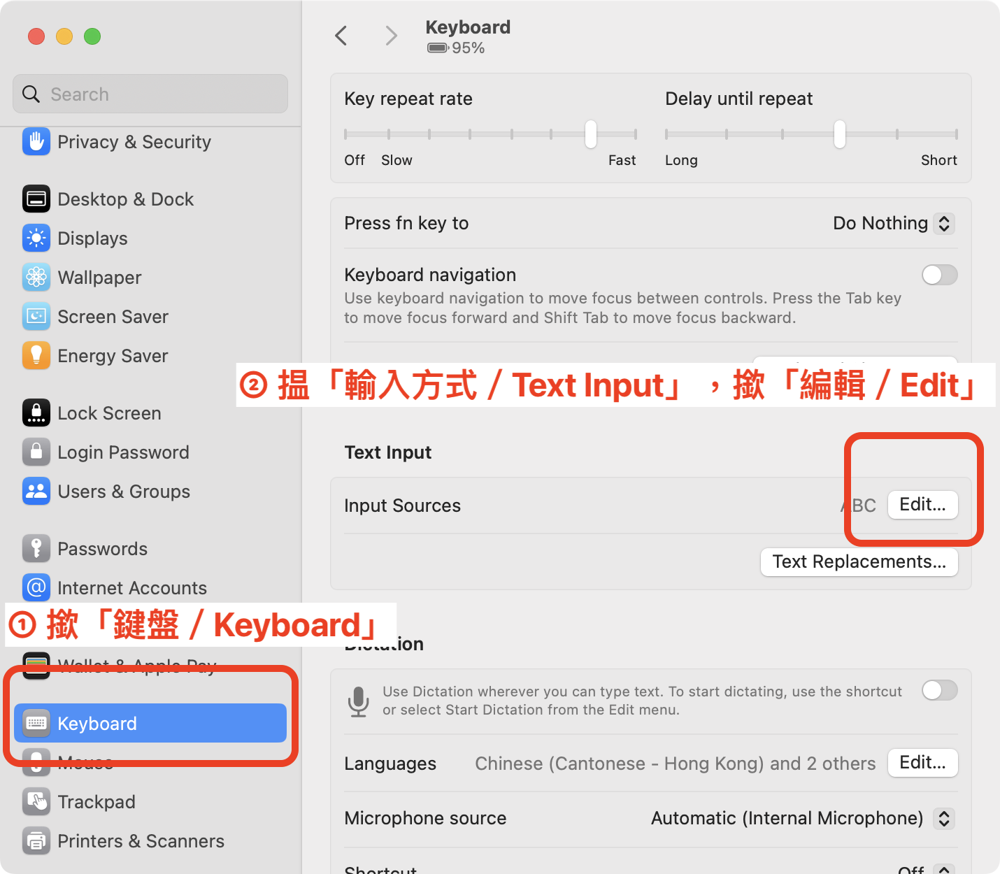
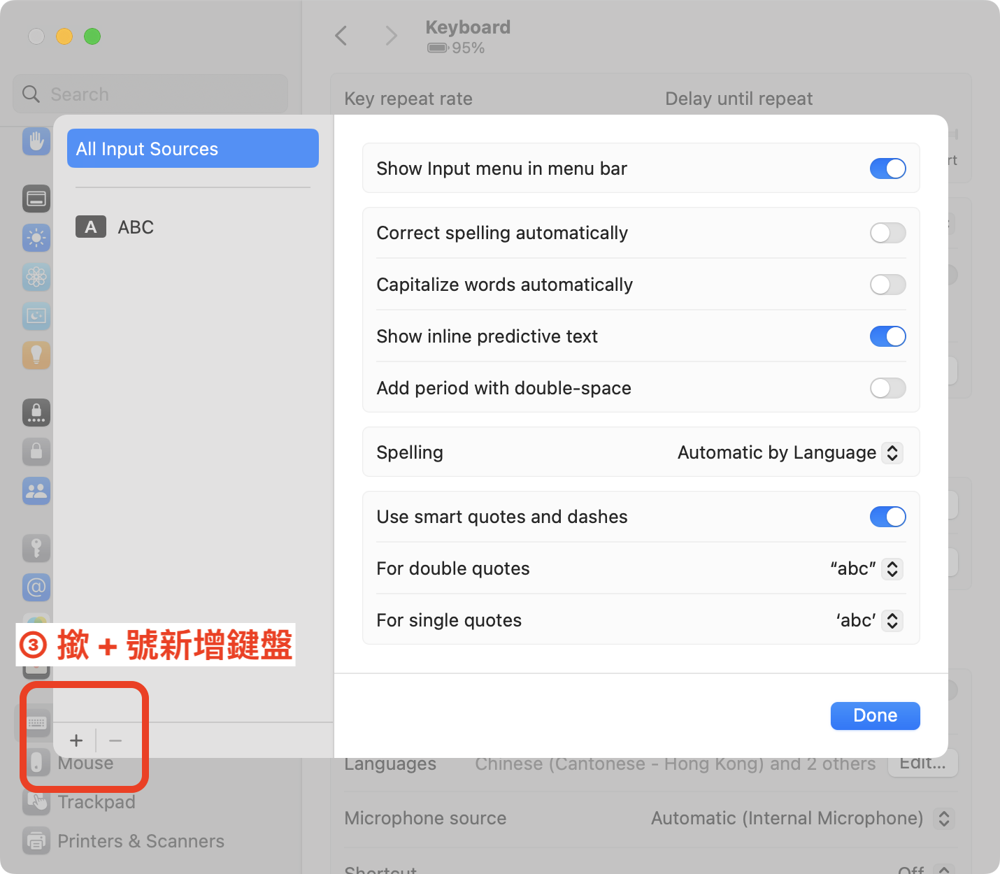
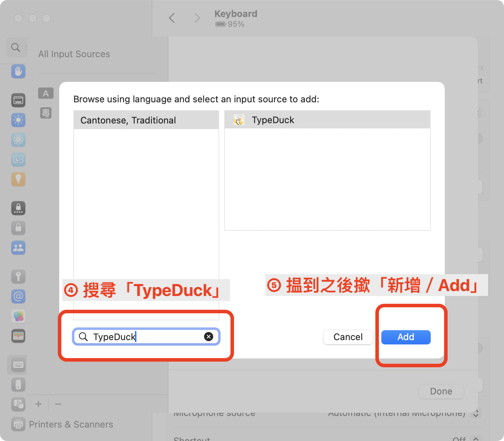
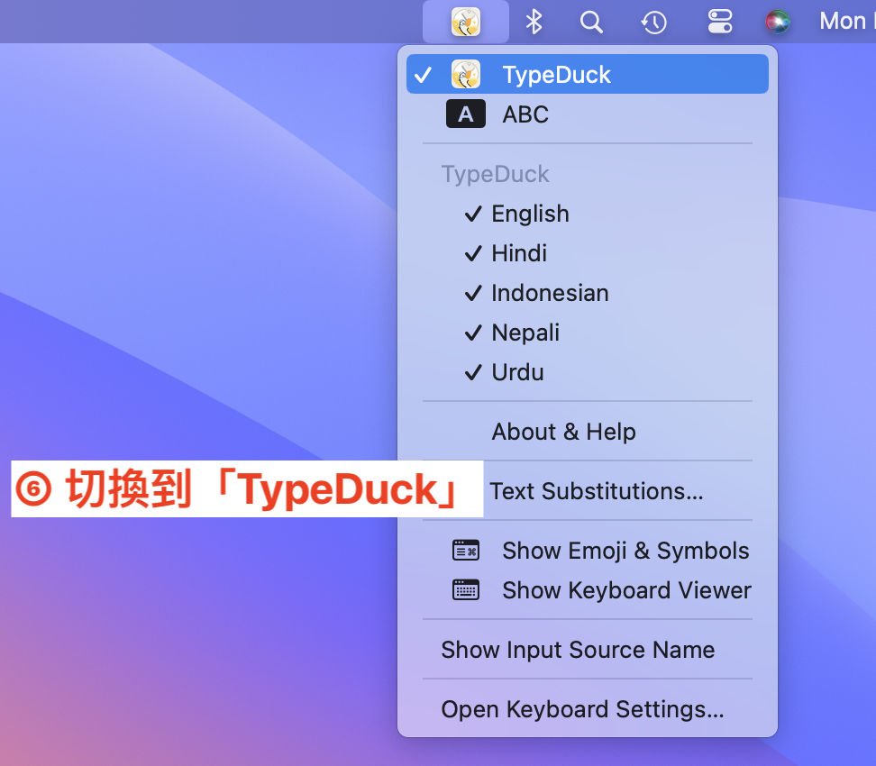

README in [粵語(Cantonese)](README.md) | [普通話(Mandarin)](README-cmn.md)

# TypeDuck for macOS
Compatibility: macOS 12 Monterey or higher.

## How to install
1. Download the PKG file on the [Releases](https://github.com/TypeDuck-HK/TypeDuck-Mac/releases) page.
2. Double-click the downloaded PKG file to start the installation.
3. Follow the on-screen instructions. During the process, the system Settings app might pop up and ask you to add the TypeDuck input method.
4. Final step, the installer will ask you to log out of your computer. It is necessary to log out and then log back in for the Mac input method to function properly.

**Note**: Logging out of your computer will quit all currently running apps.

After installing, if you don't see the TypeDuck input method, please go to system Settings app → Keyboard → Input Sources, add it manually.  
You can find TypeDuck under the *Cantonese, Traditional* language, or you can search for *TypeDuck* to find it.

 

## How to uninstall
First, go to system Settings app → Keyboard → Input Sources, and remove the TypeDuck.  
Then, delete these files / folders:
~~~bash
/Library/Input\ Methods/TypeDuck.app
~/Library/Application\ Scripts/hk.eduhk.inputmethod.TypeDuck
~/Library/Containers/hk.eduhk.inputmethod.TypeDuck
~~~

Finally, log out of you computer then log back in, or reboot your computer.

## How to build
Build requirements
- macOS 14.0+
- Xcode 15.4+

Prepare databases:
~~~bash
# cd path/to/TypeDuck-Mac
cd ./Preparing/
swift run -c release
~~~
Then use Xcode to open `TypeDuck.xcodeproj` .

Note: Do not *Run* this project, it can only be *Build* or [Archive](https://developer.apple.com/documentation/xcode/distributing-your-app-for-beta-testing-and-releases#Create-an-archive-of-your-app)

If you want to use your Mac to test the input method, you need to place the *Archive & Export* TypeDuck.app to `/Library/Input\ Methods/` .

When replacing the old TypeDuck.app, Finder may prompt a message indicating that it's running. You can terminate it using this command:
~~~bash
osascript -e 'tell application id "hk.eduhk.inputmethod.TypeDuck" to quit'
~~~

If you want to replace the CSV lexicon, please replace the `./Preparing/Sources/Preparing/Resources/data.csv` file, then reprepare databases.
