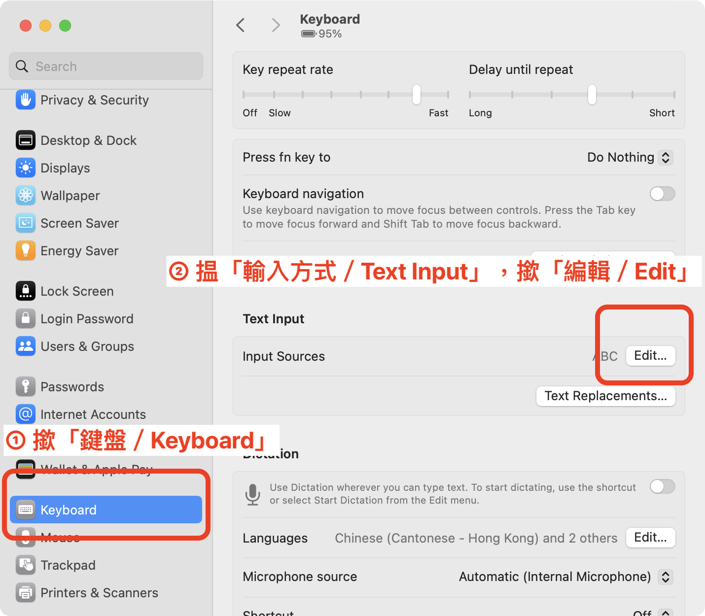
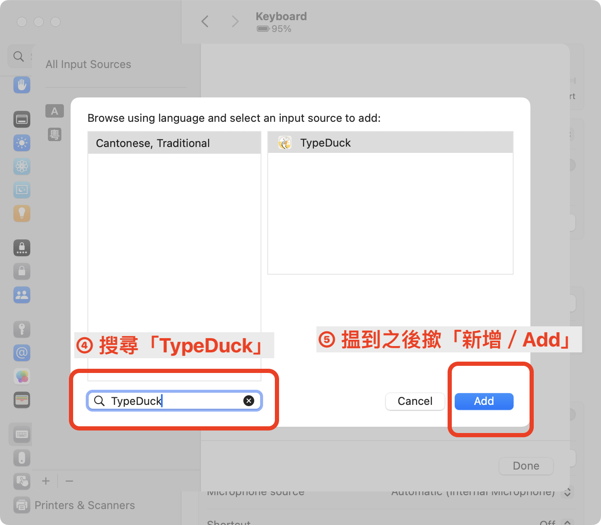
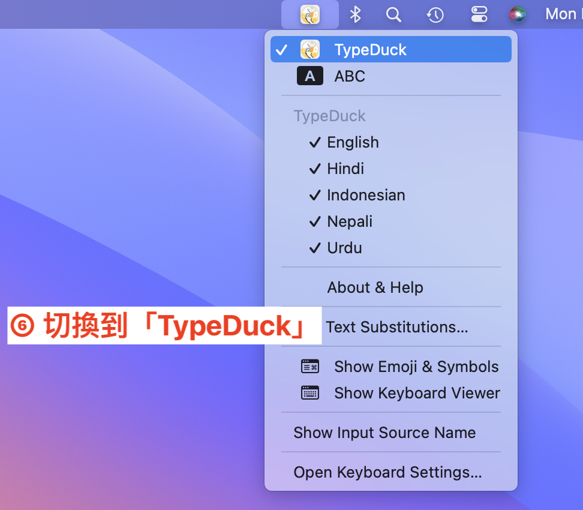

# TypeDuck for macOS
兼容性: macOS 12 Monterey 或者更高。

## 如何安裝（How to install）
1. 首先去 [Releases](https://github.com/TypeDuck-HK/TypeDuck-Mac/releases) 頁面下載個 PKG 檔案。
2. 雙擊開啟下載到嘅 PKG 檔案，開始安裝。
3. 按提示步驟進行。中途有可能系統設定App會彈出嚟，請求添加 TypeDuck 輸入法。
4. 到最後一步，安裝程式會請求你登出電腦。要登出、再登入，Mac 輸入法先會正常生效。

請注意，登出電腦嘅話會將所有程式結束運行。

安裝之後，如果見唔到有 TypeDuck 輸入法，請前往 系統設定App → 鍵盤 → 輸入方式，手動添加。  
添加嗰陣，會喺「Cantonese, Traditional」/繁體粵語/繁體廣東話 語言項揾到TypeDuck。亦可以搜尋「TypeDuck」嚟搵。

 

## 如何卸載（How to uninstall）
首先，去 系統設定App → 鍵盤 → 輸入方式，移除 TypeDuck。  
跟住，刪除以下檔案／檔案夾：
~~~bash
/Library/Input\ Methods/TypeDuck.app
~/Library/Application\ Scripts/hk.eduhk.inputmethod.TypeDuck
~/Library/Containers/hk.eduhk.inputmethod.TypeDuck
~~~

最後，登出電腦再登入，或者重啟電腦。

## 如何構建（How to build）
前置要求（Build requirements）
- macOS 14.0+
- Xcode 15.2+

先構建數據庫 (Prepare database)
~~~bash
# cd path/to/TypeDuck-Mac
cd ./Preparing/
swift run -c release
~~~
跟住用 Xcode 開啟 `TypeDuck.xcodeproj` 即可。  
注意事項: 唔好直接喺 Xcode 撳 Run，只可以 Build 或 [Archive](https://developer.apple.com/documentation/xcode/distributing-your-app-for-beta-testing-and-releases#Create-an-archive-of-your-app)

如果要喺自己本機測試，請將 Archive & Export 出來嘅 TypeDuck.app 放入 `/Library/Input\ Methods/` 檔案夾。  
如果替換舊有 TypeDuck.app 嗰陣，彈提示話佢運行緊、無法替換，可以喺 Terminal 用以下命令將佢結束運行：
~~~bash
osascript -e 'tell application id "hk.eduhk.inputmethod.TypeDuck" to quit'
~~~

如果想要替換 CSV 詞庫，請替換 `./Preparing/Sources/Preparing/Resources/data.csv` 檔案，再依上文重新構建一次數據庫。
